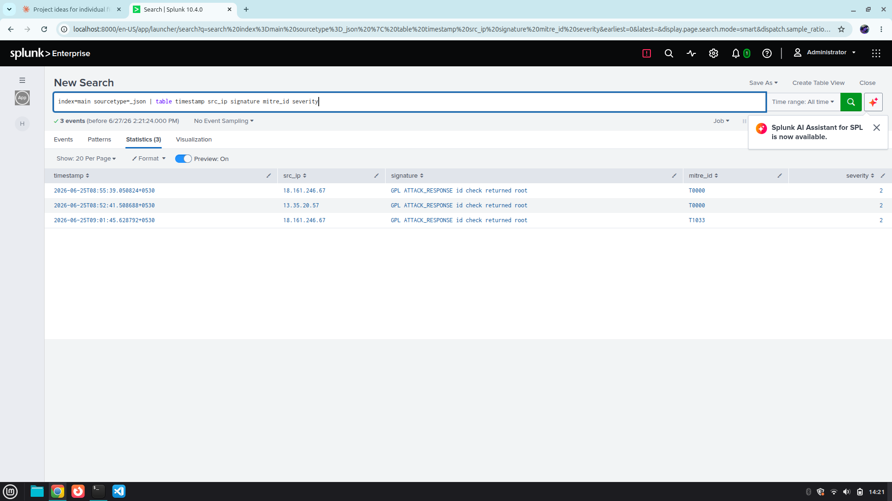
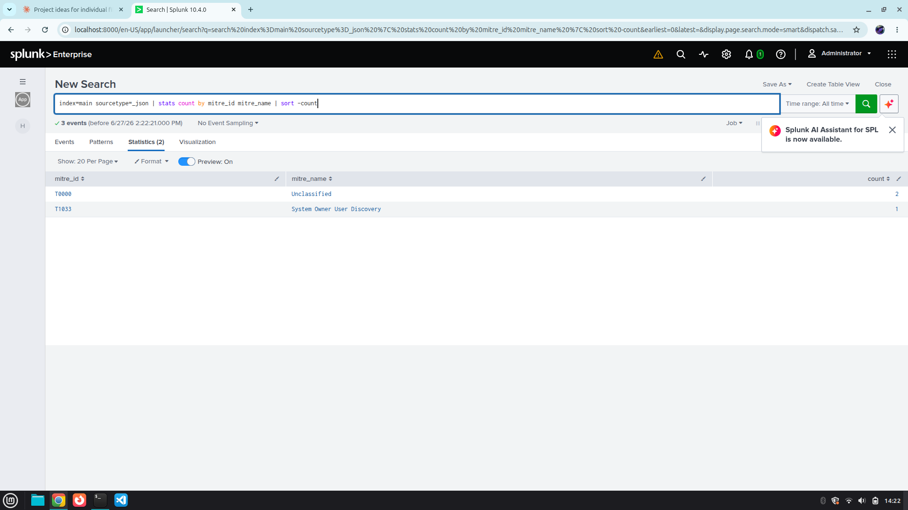

# Home Network Intrusion Monitor

A real-time network intrusion detection system built on Suricata, Python, iptables, auditd and Splunk.

## Status
- [x] Day 1: Project structure created
- [x] Day 2: Suricata installed and configured
- [x] Day 3: Python parser with MITRE tagging
- [x] Day 4: iptables + fail2ban blocking
- [x] Day 5: Splunk dashboard
- [x] Day 6: auditd hardening
- [ ] Day 7: Documentation complete

## Architecture
Suricata IDS → Python Parser → iptables blocking + Splunk SIEM

## Tools Used
- Suricata IDS
- Python 3
- iptables + fail2ban
- auditd
- Splunk Free
- MITRE ATT&CK Framework
## Dashboard Screenshots

### Alerts Table

### MITRE ATT&CK Technique Frequency

